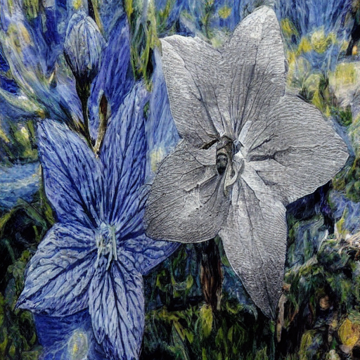

# Mask-Based Multi-Style Transfer  (Ours)



# SetUP

## Create a Conda Environment

```
conda env create -f environment.yaml
conda activate StyleID
```

## Download StableDiffusion Weights

Download <a href='https://huggingface.co/CompVis/stable-diffusion-v-1-4-original/tree/main'>Model weight (sd-v1-4.ckpt)</a> and put it in the `models/ldm/stable-diffusion-v1/model.ckpt` **(rename: `sd-v1-4.ckpt` > `model.ckpt`)**

## Prepare dataset
`data/vis/dataset.txt`

## Description of Folders

- `data_styleid`: dataset of existing StyleID
- `data_vis`: **datset for Our inference**
    - `/cnt`: content images and `mask.npy`
    - `/sty`
        - `/char`: character style images
        - `/back`: background style images
    - `/mask`: content mask images
- `dataset_ours`: our dataset
- `output_dk`: output dir
- `precomputed_feats_k`: `feature map.pkl` after DDIM Inversion

# Inference
First, store the **content images** in `data_vis/cnt`, the **character images** in `data_vis/sty/char`, the **background images** in `data_vis/sty/back`, and the **content mask images** in `data_vis/mask`.


## DDIM Inversion for saving feature map

is saved in `precomputed_feats_k`

```
python generate_pkl_only.py --cnt data_vis/cnt --sty data_vis/sty --data_root ./data_vis
```

## Content Mask Generation

### Option 1. FastSAM

```
Developing ...
```

### Option 2. Gradio

```
python gradio_make_mask.py
```

## Create `mask.npy` for Content Image only
is saved in `./data_vis/cnt`

```
python make_mask_npy.py --mask_dir ./data_vis/mask --save_dir ./data_vis/cnt
```

## Directory Structure Before Inference

```
data_vis
├── cnt
│   ├── {content}.jpg
│   └── {content_mask}.npy
└── sty
    ├── char
         └── {char}.jpg
    └── back
         └── {back}.jpg
```


## Inference

- Gamma: Query preservation
- T: Tau (variance of attention map)
- Ratio: High-frequency radius ratio

```
python run_ori.py --gamma 0.5 --T 1.5 --ratio 0.5 --data_root ./data_vis
```

Check `output_dk` dir!!!